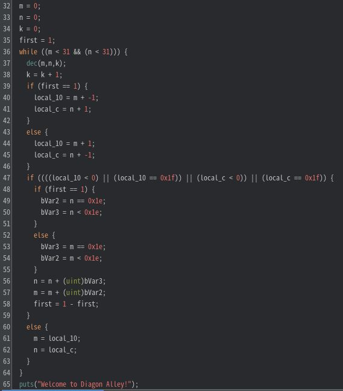
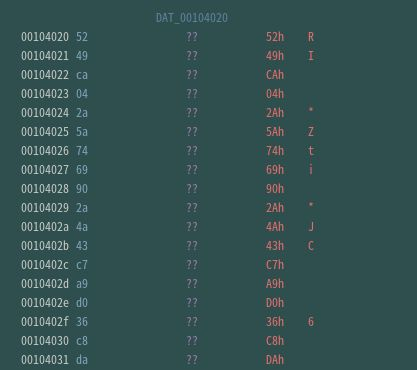

# My solution for FlooPowder
ストリップされたELFファイルが配られる。
```
file chall 
chall: ELF 64-bit LSB pie executable, x86-64, version 1 (SYSV), dynamically linked, interpreter /lib64/ld-linux-x86-64.so.2, BuildID[sha1]=776dffe245b2711ecf0e4fc4b9d08fb1a7a02049, for GNU/Linux 3.2.0, stripped
```
Ghidraでmain関数（entry内の`__libc_start_main` の第一引数）を解析すると、まず入力文字列を31回受け取っていることがわかる。入力文字列の長さは31文字でなければならず、さらには`0`あるいは`1`でなければならない。入力文字列が格納される配列`buf`のサイズは961である。


入力文字列が正しいかどうかのチェックは以下の部分で行われている。しかし、入力文字列に関する処理はmain関数では行われておらず、`dec`関数（37行目）で行われていそうなので、まずは`dec`関数を解析する。



dec関数(`0x001011ca`)の処理は、以下の手順である。
1. `buf`配列のあるインデックスが1であるかどうかを判定
2. インデックスは、第一引数と第二引数から計算される
3. `DAT_00104020アドレス + (param_3/0x1f) * 4` の値を何らかの数値分右シフトし、 その結果が1であるかを判定
4. 1.と3.の真偽値が同じであればチェック通過


ここで、Ghidraのデコンパイル結果がわかりにくいため注意する必要がある。`DAT_00104020`アドレス付近の値はint型にキャストされているため、`DAT_00104020` はint型の配列と考えることができる。この情報をGhidraに教えるとデコンパイル結果がわかりやすくなる。
`DAT_00104020`全体を選択し、右クリックし `DATA` -> `Choose Data Type` で `int[31]` と入力する。すると、サイズ31のint型配列が生成され、デコンパイル結果も分かりやすくなる。




正しい入力文字列`buf`を求めるには、 上記の3.を実装しその判定結果によって、`buf[param1 * 0x1f + param2]` に`0`と`1`のどちらが入るかを決定すればよい。ここで、`dec`関数の引数は入力文字列にも`dec`関数の処理にも依存していないので、デコンパイル結果をそのまま利用すればよい。以上の観察から以下のソルバーを書くことで正しい入力文字列を31個生成することができる。

```c
#include <stdio.h>
#include <stdbool.h>

/* extract from Ghidra using LazyGhidra (convert_to_c_array_dword)
 * https://github.com/AllsafeCyberSecurity/LazyGhidra 
*/
unsigned int array[31] = {
    0x04CA4952, 0x69745A2A, 0x434A2A90, 0x36D0A9C7, 0x1002DAC8, 0x04933AEB, 0x71A29525, 0x6DA8D531, 
    0x69259680, 0x2179213C, 0x5D8A6097, 0x6ACA2822, 0x5495ED02, 0x255A2CD5, 0x16B5625A, 0x2E8A8ABA, 
    0x2D6F5EB4, 0x557CD952, 0x2CB4E495, 0x020D29B9, 0x0E8B2854, 0x4646C159, 0x47749281, 0x54229D46, 
    0x6C1CD620, 0x07F80EFF, 0x04AD46A4, 0x32EBC04E, 0x4FAC1623, 0x600E1F04, 0x24CD3000
};

void dec(int input[31][31], int param_1,int param_2,int param_3)
{
    long index1 = (long)param_1 * 0x1f + (long)param_2;
    int index_array = (long)(param_3 / 0x1f);
    int shift = (30 - (char)(param_3 % 0x1f)) & 0x1f;
    int index2 = (array[index_array] >> shift & 1);

    if (index2 != 0) {
        input[index1/31][index1%31] = 1;
    }
    else {
        input[index1/31][index1%31] =  0;
    }
}

int main(void)
{
    int m = 0;
    int n = 0;
    int k = 0;
    int first = 1;
    int local_10;
    int local_c;
    bool bVar2;
    bool bVar3;
    int input[31][31];
    while((m < 0x1f && (n < 0x1f))) {
        dec(input, m, n, k);
        k = k + 1;
        if (first == 1) {
            local_10 = m - 1;
            local_c = n + 1;
        }
        else {
            local_10 = m + 1;
            local_c = n - 1;
        }
        if ((((local_10 < 0) || (local_10 == 0x1f)) || (local_c < 0)) || (local_c == 0x1f)) {
            if (first == 1) {
                bVar2 = n == 0x1e;
                bVar3 = n < 0x1e;
            }
            else {
                bVar3 = m == 0x1e;
                bVar2 = m < 0x1e;
            }
            n = n + (unsigned int)bVar3;
            m = m + (unsigned int)bVar2;
            first = 1 - first;
        }
        else {
            m = local_10;
            n = local_c;
        } 
    }

    for (int i = 0; i < 31; i++) {
        for (int j = 0; j < 31; j++) {
            printf("%d", input[i][j]);
        }
        printf("\n");
    }
    printf("\n");
}
```

```
0000000000000000000000000000000
0111111100100011010010011111110
0100000101101100111100010000010
0101110100111001100001010111010
0101110101101010111100010111010
0101110100010110000001010111010
0100000101010011100001010000010
0111111101010101010101011111110
0000000000000100110111000000000
0111110111110110001011101010100
0001001010100010010001111111100
0101000110101111111101001100000
0100110011111000100100100110100
0001010101101010101111001011000
0000011001110110011001000101000
0111000100100011101001010111000
0111110001010100010000011110110
0100101111000111000000000110100
0101101000100011011011101110100
0100011100011101101001111011000
0101100011011001100001101010100
0100100100111000110001111101000
0000000001010110000111000101000
0111111101100011110011010100000
0100000100000110010101000100000
0101110101000101101101111111110
0101110101000000010011101110110
0101110101111100100111011100100
0100000101101001110010101000100
0111111101111000111110011111000
0000000000000000000000000000000
```

この問題は、ようやく求まった0と1のバイナリからどうにかしてフラグをさらに求める必要がある。答えは、0を白、1を黒とみなすとQRコードと見ることができ、そのQRコードを読み込むとフラグが求まるというものである（らしい）。

QRコードも生成する最終的なソルバーは、[これ](../solve/solve.c)である。この問題はエスパーを要するため、個人的に微妙な問題だと感じている。0と1の入力文字列を求めるところまでは良問だと思う。


# Further study
先程Ghidraにはデータ構造を正しく教えてやる必要があると言ったが、IDAにはそんなこと必要ない。流石のIDAである。IDA Freeユーザでもクラウドベースのデコンパイラが使えるのは素晴らしい。


